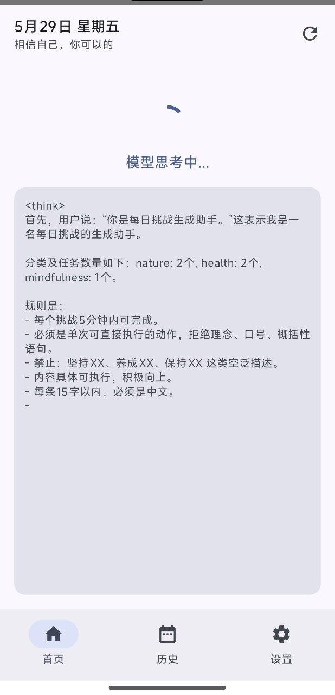
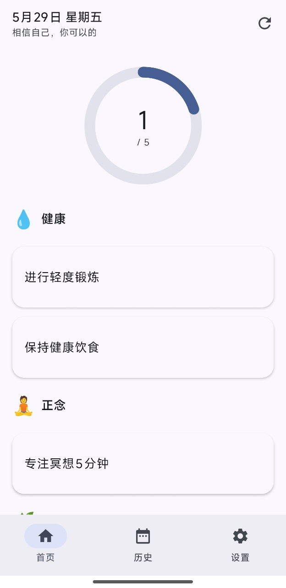

# ModelTest - 端侧大模型推理应用

一款基于 Android 端侧推理的每日挑战生成应用。通过本地运行大语言模型（LLM），为用户自动生成个性化的每日微挑战任务，帮助养成积极的生活习惯。

## 核心功能

- **端侧 LLM 推理**：完全离线运行，无需联网，保护用户隐私
- **流式生成**：实时展示模型思考过程（streaming tokens），支持自动滚动
- **每日挑战生成**：根据用户设置的分类和数量，AI 生成可执行的微挑战
- **挑战完成追踪**：记录完成状态，支持历史统计和分类分布图表
- **多分类支持**：健康、正念、学习、创造、社交、运动、自然等分类

## 运行效果

### 模型思考过程

实时展示模型的推理思考过程，自动滚动到最新内容：



### 生成结果

模型根据用户设置的分类和数量，生成个性化的每日挑战：



## 技术架构

### 推理框架

| 组件 | 技术 | 说明 |
|------|------|------|
| 推理引擎 | [llama.cpp](https://github.com/ggerganov/llama.cpp) | 高性能 C/C++ LLM 推理库 |
| JNI 桥接 | `llama_wrapper.cpp` | 自定义 JNI 接口，封装 4 个核心方法 |
| 模型格式 | GGUF | `MiniCPM-V-4_6-Q4_0.gguf`（Q4 量化） |
| 运行后端 | CPU | `n_gpu_layers = 0`，纯 CPU 推理 |
| 架构支持 | arm64-v8a | 仅支持 64 位 ARM 处理器 |

#### JNI 接口（`LlamaNative.java`）

```
initBackend()          → 初始化 llama.cpp 后端
loadModel(path, nCtx)  → 加载模型，返回 context 指针
generate(ctx, prompt, maxTokens)           → 非流式生成
generateStreaming(ctx, prompt, maxTokens, callback) → 流式生成
freeContext(ctx)        → 释放资源
```

#### 原生库加载顺序（严格顺序）

```
ggml-base → ggml → llama → ggml-cpu-android_armv8.2_1 → modeltest
```

> ⚠️ 加载顺序不可更改，否则会导致崩溃。`ggml-cpu-android_armv8.2_1` 采用 try/catch 优雅降级。

### 界面框架

| 框架 | 用途 |
|------|------|
| **Jetpack Compose** | 主界面框架（Material 3 Design） |
| **XML Layout** | `GoActivity` 启动页（旧代码保留） |
| **Navigation Compose** | 底部导航（首页 / 历史 / 设置） |
| **Material 3** | 主题、卡片、按钮等 UI 组件 |

### 数据存储

| 组件 | 用途 |
|------|------|
| **Room Database** | 本地 SQLite ORM，存储挑战、分类、完成记录 |
| **KSP** | 编译时注解处理（Room 代码生成） |

#### 数据库表

- `categories` — 挑战分类（name, displayName, emoji, promptKey）
- `challenges` — 每日挑战（categoryId, text, date）
- `challenge_completions` — 完成记录（challengeId, completedAt）
- `user_settings` — 用户配置（dailyChallengeCount, defaultCategories）

### 其他依赖

| 库 | 用途 |
|------|------|
| [Vico](https://github.com/patrykandpatrick/vico) | 柱状图 / 折线图（历史统计） |
| [Confetti](https://github.com/jinatonic/confetti) | 全部完成时的撒花动画 |
| Coroutines + Flow | 异步操作、响应式数据流 |
| AndroidX Lifecycle | ViewModel、生命周期管理 |

## 项目结构

```
app/src/main/
├── java/com/example/modeltest/
│   ├── LlamaNative.java              # JNI 绑定类
│   ├── MainActivity.kt               # 空 Compose 占位
│   ├── GoActivity.kt                 # 启动页（模型加载）
│   ├── llm/
│   │   ├── LlmService.kt             # LLM 服务封装（单例）
│   │   ├── TokenCallback.java         # 流式回调接口
│   │   └── ChallengeParser.kt         # JSON 解析挑战
│   ├── data/
│   │   ├── AppDatabase.kt             # Room 数据库
│   │   ├── ChallengeRepository.kt     # 数据仓库
│   │   ├── dao/                       # DAO 接口
│   │   └── entity/                    # 数据实体
│   └── ui/
│       ├── home/                      # 首页（挑战生成/展示）
│       ├── history/                   # 历史统计
│       ├── settings/                  # 用户设置
│       └── components/                # 通用组件
├── cpp/
│   ├── llama_wrapper.cpp              # JNI 桥接实现
│   └── CMakeLists.txt                 # NDK 构建配置
├── jniLibs/arm64-v8a/                 # 预编译 .so 文件
│   ├── libggml-base.so
│   ├── libggml.so
│   ├── libllama.so
│   └── libggml-cpu-android_armv8.2_1.so
├── assets/models/                     # 模型文件
│   └── MiniCPM-V-4_6-Q4_0.gguf
└── keepRules/rules.keep              # ProGuard 混淆规则
```

## 构建与运行

```bash
# 构建 Debug APK
./gradlew assembleDebug

# 安装到设备
./gradlew installDebug

# 单元测试
./gradlew testDebugUnitTest

# 仪器测试
./gradlew connectedDebugAndroidTest
```

### 环境要求

- Android Studio Hedgehog+
- JDK 11+
- NDK（CMake 构建原生代码）
- arm64-v8a 架构设备（真机或模拟器）
- `compileSdk 36`，`minSdk 28`

## 关键配置

| 参数 | 值 | 说明 |
|------|----|------|
| `N_CTX` | 4096 | 上下文窗口大小 |
| `MAX_TOKENS` | 4096 | 最大生成 token 数 |
| `n_threads` | 4 | CPU 推理线程数 |
| `n_gpu_layers` | 0 | 纯 CPU，不使用 GPU |
| `android:largeHeap` | true | 模型需要大内存 |

## 注意事项

- **原生库加载顺序严格**：`ggml-base` 必须先于 `ggml` 加载
- **模型拷贝阻塞**：首次启动时模型从 assets 拷贝到外部存储，会阻塞 UI
- **内存占用大**：4-bit 量化模型仍需约 500MB+ 内存
- **仅支持 arm64**：其他架构无法运行

## License

MIT
